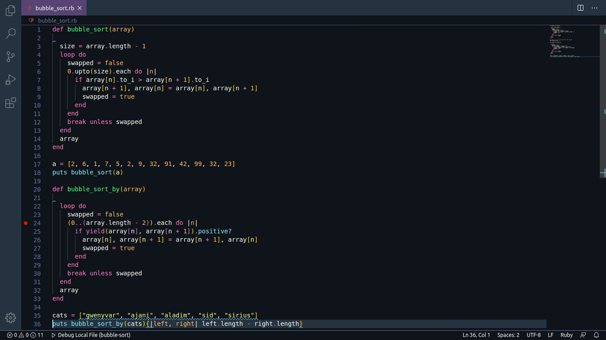

# Bubble Sort
  This is the Bubble-Sort algorithm, a very basic and known sorting solution for arrays that perform incredibly NOT well. It takes two items of a sequence of numbers and compare them; if the first is bigger than the second, they change places. This can take forever in huge sequences, and it may take several passes until it is done. 
  This is my first attempt at coding in Ruby. I didn't create any fancy solutions, mine is pretty standard: I'm still figuring out the ropes of Ruby itself.
  Here's a pic of the code:
  
